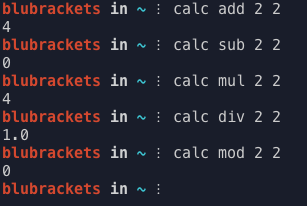

# CalCLI
CalCLI is meant to be a command line calculator. Though only in beta mode it still is a nifty little tool...

#Dependencies
Python 2 - 3.x

#Installation
Run this in your terminal:
```
cd ~
git clone https://github.com/blubrackets/CalCLI.git
python3(or python2) ~/CalCLI/setup.py
```

If you dont have a .bash_profile for your terminal yet, before the installation above type:
```
cd ~
touch .bash_profile
```

Then restart your terminal/commandprompt and type:
`calc --help`

#Screenshot
Like a good little boy I took a picture:<br />

